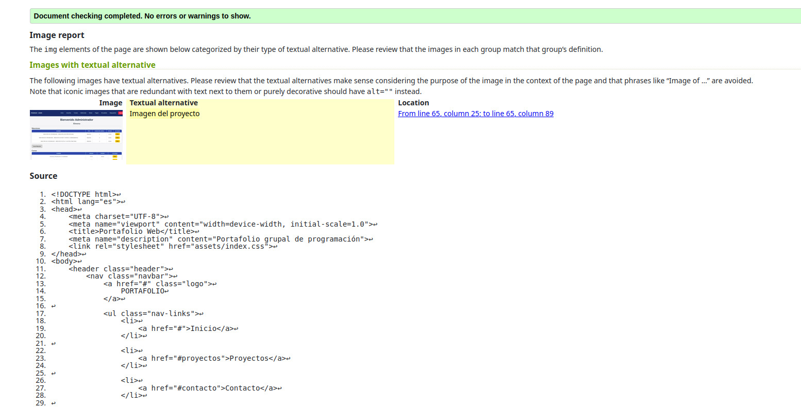
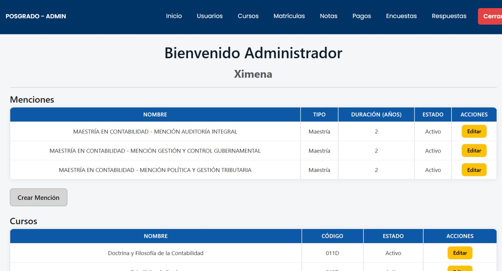

# Registro de errores encontrados y correcciones

Durante la validación del proyecto se encontraron tres errores principales. Cada uno fue corregido manualmente desde VS Code.

---

## Error 1 — Problema responsive en Firefox

### ¿Cuál fue el error?

El diseño de la página no se adaptaba correctamente cuando se visualizaba en el navegador Mozilla Firefox y se modificaba el tamaño de la ventana.

Algunos elementos podían presentar problemas de distribución debido a las reglas utilizadas para el diseño responsive.

### Evidencia del error



### ¿Cómo se corrigió?

Se revisó manualmente la estructura HTML y las reglas CSS responsables del diseño responsive.

Se verificó principalmente la configuración del viewport:

```html
<meta name="viewport" content="width=device-width, initial-scale=1.0">
```

También se revisaron las reglas `@media`, los tamaños de los elementos y el uso de unidades relativas para evitar que los componentes tuvieran dimensiones rígidas.

Finalmente, se realizaron pruebas manuales en Firefox utilizando diferentes tamaños de ventana para comprobar que el contenido se adaptara correctamente.

### Resultado

El diseño responsive fue corregido y la página puede adaptarse correctamente a diferentes tamaños de pantalla en Firefox.

---

## Error 2 — Atributo alt incorrecto en la imagen

### ¿Cuál fue el error?

La imagen del proyecto tenía un atributo `alt` demasiado genérico:

```html

```

El texto alternativo no identificaba específicamente qué proyecto aparecía en la imagen.

### Evidencia del error

### ¿Cómo se corrigió?

Se modificó manualmente el atributo `alt` para describir correctamente el contenido de la imagen.

**Antes:**

```html
<div class="project-image">
    
</div>
```

**Después:**

```html
<div class="project-image">
    
</div>
```

### Resultado

El atributo `alt` ahora identifica correctamente la imagen como:

`Proyecto Contable Posgrado`

Esto mejora la accesibilidad de la página y permite que los lectores de pantalla puedan interpretar mejor el contenido de la imagen.

---

## Error 3 — Imagen con alta latencia de carga

### ¿Cuál fue el error?

La imagen utilizada en el proyecto estaba en formato JPEG:

`Proyecto.jpeg`

El recurso tenía un tamaño que podía generar una mayor latencia durante la carga de la página.

Este problema fue identificado durante la revisión de rendimiento realizada con Lighthouse.

### Evidencia del error

### ¿Cómo se corrigió?

Se optimizó manualmente la imagen convirtiéndola del formato JPEG al formato WebP.

**Antes:**

`Proyecto.jpeg`

**Después:**

`Proyecto.webp`

También se actualizó manualmente la referencia de la imagen en el HTML.

**Antes:**

```html
<div class="project-image">
    
</div>
```

**Después:**

```html
<div class="project-image">
    
</div>
```

### Resultado

La imagen ahora utiliza el formato WebP, reduciendo el tamaño del recurso y mejorando su tiempo de carga.

Esto permite disminuir la cantidad de datos que debe descargar el navegador y mejora el rendimiento de la página.

---

## Resumen

| Error | Problema encontrado | Solución aplicada |
|-------|---------------------|--------------------|
| 1 | Diseño responsive con problemas en Firefox | Se revisaron y ajustaron manualmente las reglas responsive, viewport y distribución de elementos |
| 2 | `alt` demasiado genérico | Se cambió por `alt="Proyecto Contable Posgrado"` |
| 3 | Imagen con alta latencia | Se convirtió `Proyecto.jpeg` a `Proyecto.webp` y se actualizó su referencia |

## Herramientas utilizadas

- **Lighthouse**: evaluación de rendimiento, accesibilidad, buenas prácticas y SEO.
- **WAVE**: evaluación de accesibilidad.
- **W3C Validator**: validación de la estructura y sintaxis HTML.
- **VS Code**: realización manual de las correcciones.

Las correcciones fueron realizadas manualmente en el código fuente. La inteligencia artificial se utilizó únicamente para interpretar los reportes obtenidos durante la validación.
